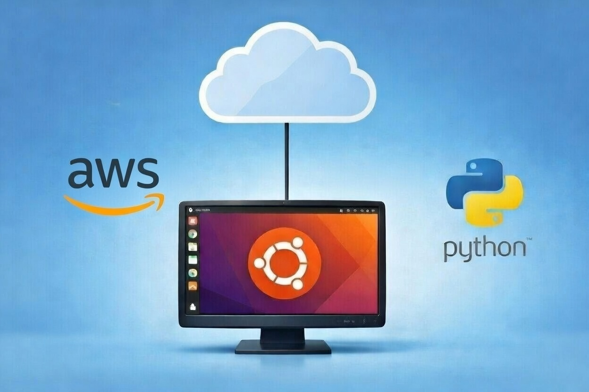
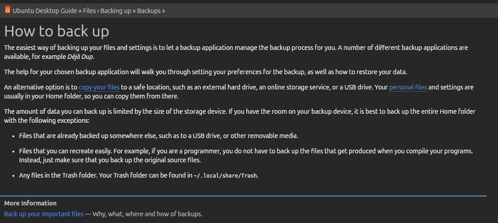

  

# Backup your Ubuntu files to s3

Backup your Ubuntu instances to s3 using boto3

## Motivation

Users running Ubuntu Desktop 24.03 LTS for daily use want to avoid any data loss and potential downtime setting up a new machine in the result of hardware failure.

## Ubuntu desktop user guide reccomendations

Consulting the Ubuntu users manual took me to this page:

This repository will act as a tool to copy files from the home folder to s3. 

# Useage
